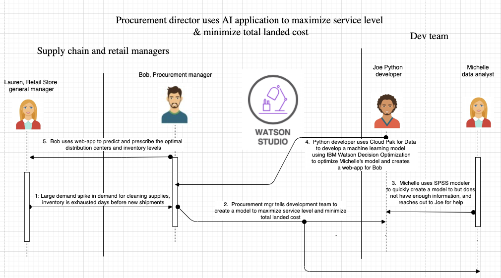

# Develop an intelligent inventory and distribution strategy using AI 

One of the most important parts of being a retail store today, going against the likes of Amazon, Etsy, and 
other online stores is optimizing inventory. If you have too much inventory, you're 
losing money on the items that you have not sold. If you have too little, and customers expect you to have 
a certain item, the customer will lose their trust and go elsewhere to purchase that same item. Finding the 
perfect balance by predicting demand is ultimately an optimization problem, one fit for machine learning.
Not only that, but as global supply chains are disrupted, a procurement manager must pick the optimal 
routes to deliver goods on time to the retail store. With thousands of different possible combinations, 
each with their own advantages, it would take days or even weeks for a manager to pick the optimal 
distribution route if they were to check each possible combination by hand. Again, this solution can 
be solved with machine learning.

Imagine that a large demand spike in cleaning supplies causes our inventory to be exhausted 
days before new shipments arrive. Machines can learn from this. Using this 
data to train our machine learning model, we can predict demand for certain items more accurately in the 
future, and ensure that our customers will be able to purchase what they want. Lastly, as a procurement
manager of multiple stores, we want to ensure that our supply chain is as efficient as possible, taking 
the most direct route, so that inventory is filled quickly, in a cost-effective manner. 

Using this scenario as our case study, we will take the view of the procurement manager. The procurement 
manager is notified by Lauren, the retail store manager whose inventory for certain cleaning supplies 
has been exhausted days ahead of schedule. Bob, the procurement manager, gives the task to the development 
team to take the inventory demand data, denoted as `Actuals` in the data set, as a way to train a machine learning model. The model will 
predict demand in the future which will help optimize demand and find the optimal routes for the supply to reach
the retail stores. In the next few paragraphs, we will explain how the development team will use machine 
learning tools and techniques to solve this problem.

## Set up IBM Cloud Pak for Data on OpenShift
We use various services that are available within IBM Cloud Pak for Data to analyze data, build, deploy, and monitor the machine learning model. IBM Cloud Pak for Data is a data and AI platform that runs on a RedHat OpenShift Kubernetes Container.

You can install IBM Cloud Pak for Data through a tile in the IBM Cloud catalog, and the Install Cloud Pak for Data from the IBM Cloud catalog tutorial provides detailed steps.

## Predict future demand using SPSS Modeler 

Michelle, the data analyst takes on the task to build a machine learning model using SPSS Modeler on IBM Cloud. After she builds a model, she uses the model
to predict future demand for specific products in the retail store. Michelle 
visualizes the demand, and sends the output to Joe to use this predicted 
demand as input to his decision optimization model.

## Create a machine learning model to optimize inventory based on demand
Joe takes the predicted demand given by Michelle, and uses that as a 
constraint into his decision optimization problem. First he uses the 
model builder and NLU solution on IBM Public Cloud to build his model.
Next, he uses CPLEX to identify the constraints, 
namely the distribution centers, and the the max amount of inventory the store can carry, and he uses this 
to build his solution.

## Create a machine learning model to optimize distribution routes based on inventory 
Once Joe has built the solution to optimize inventory levels based on demand, the last 
part of the solution will be to pick the optimal routes and distribution centers to 
replenish inventory levels. Using geolocation and IBM's Decision Optimization engine,
Joe is able to find the optimal route, which will not only save money for the corporation
but also ensure that customers are happy. 

## Create a web-application for the procurement manager to use
To make his machine learning model easy to use, Joe quickly builds a web-app 
that is invoking the inventory optimization and distribution route optimization 
models that he has deployed. He is able to wrap his models in a UI such that 
anyone can quickly get optimal results. Not only that, but as he trains the model 
with new data, and he can quickly re-deploy once demand shifts again. 

## Conclusion
In this case study, we've seen how a development team can help their procurement manager 
by building machine learning models to predict optimal inventory levels based on past demand, 
and optimal routes for their distribution network of suppliers. All in all, the manager 
is able to make data driven decision in seconds, by the use of a web-app that is 
enabled by machine learning models. The manager is confident he is making the best decision
he can with the data at his disposal, and his company is able to serve its customers well, and 
increase profits. As demand changes, new data is added to the machine learning model, and the 
model is re-trained to ensure accuracy. With these new tools and techniques, our retail 
organization is able to go up against e-commerce based companies knowing they are optimizing 
their decisions with the power of data. 
