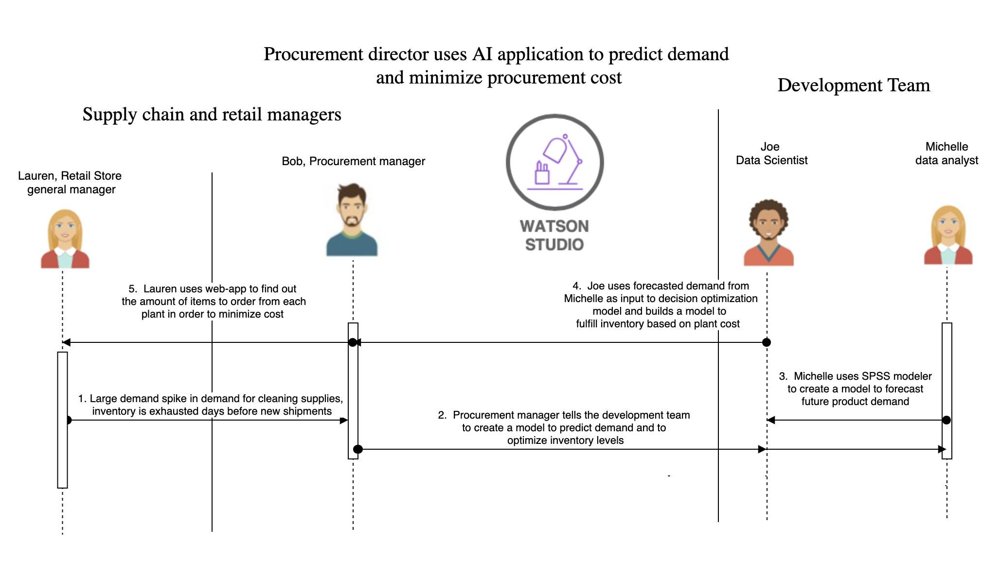

# Develop an intelligent inventory and procurement strategy using AI 

One of the most important parts of being a retail store today, going against the likes of Amazon, Etsy, and 
other online stores is optimizing inventory. If you have too much inventory, you're 
losing money on the items that you have not sold. Finding the 
perfect balance by predicting demand is one fit for machine learning.

Imagine that a large demand spike in cleaning supplies causes our inventory to be exhausted 
days before new shipments arrive. Machines can learn from this. Using this 
data to train our machine learning model, we can predict demand for certain items more accurately in the 
future, and ensure that our customers will be able to purchase what they want.

Using this scenario as the basis for our case study, we will take the view of the procurement manager. The procurement 
manager, Bob is notified by Lauren, the retail store manager whose inventory for certain cleaning supplies 
has been exhausted days ahead of schedule. Bob gives the task to the development 
team to take the past demand data and train a machine learning model to predict future demand. The model will 
predict demand in order to optimize inventory and minimize procurement cost. Once we've predicted demand, we will use that demand as an input to
our optimization problem. Our optimization problem will solve the problem of which plant to order items from in 
order to minimize cost. In the next few paragraphs, we will explain how the development team will use machine 
learning tools and techniques to solve these problems.

<!-- ## Set up IBM Cloud Pak for Data on OpenShift
We use various services that are available within IBM Cloud Pak for Data to analyze data, build, deploy, and monitor the machine learning model. IBM Cloud Pak for Data is a data and AI platform that runs on a RedHat OpenShift Kubernetes Container.

You can install IBM Cloud Pak for Data through a tile in the IBM Cloud catalog, and the Install Cloud Pak for Data from the IBM Cloud catalog tutorial provides detailed steps. -->

## Predict future demand using SPSS Modeler 
Michelle, the data analyst takes on the task to build a machine learning model using SPSS Modeler on IBM Cloud. After she builds a model, she uses the model
to predict future demand for specific products in the retail store. Michelle 
visualizes the demand, and sends the output to Joe to use this predicted 
demand as input to his decision optimization model. Use the [predict future product demand using SPSS Modeler](tutorials/spss-tutorial/spss.md) tutorial to see a step-by-step approach of building a 
machine learning model using a flow-based editor.

## Create a machine learning model to optimize plant selection based on cost
Once Joe receives the predicted demand from Michelle, he uses that as an input
to the decision optimization problem, along with cost and capacity of the plants 
that produce the items that he needs to replenish. Using IBM's Decision Optimization engine,
Joe is able to find the optimal combination of warehouses to select in order to minimize 
procurement cost while still replenishing inventory as suggested by the estimated demand. 
Use the [Optimize plant selection based on cost and capacity with Decision Optimization](tutorials/decision-optimization-tutorial/README.md) tutorial to see a step-by-step approach 
of building a decision optimization model using UI-based modeling assistant.

## Create a web-application for the procurement manager to use
To make his machine learning model easy to use, Joe deploys his decision 
optimization model created from the previous step to production, and 
accesses it via API. The input to the model is the demand generated from 
the SPSS model he has deployed, and this model will be run periodically to 
get the latest predicted demand. He builds a web-application that calls the 
deployed model via API in order to allows the store manager to optimize 
inventory and reduce cost based the demand prediction. 

The application displays the results of Decision Optimization - the optimal 
combination of plants and the number of items to order from each plant. Use 
the [Create a web-application to optimize plant selection based on cost and capacity](web-app/README.md) to see how to 
build a web-application that accesses a deployed decision optimization 
model via API and displays the results for the manager to 
use. 

## Conclusion
In this case study, we've seen how a development team can help their procurement manager 
by building machine learning models to predict future demand, and an optimal procurement
strategy. All in all, the manager 
is able to make data driven decision in seconds, by the use of a web-app that is 
enabled by machine learning models. The manager is confident he is making the best decision
he can with the data at his disposal, and his company is able to serve its customers well, and 
increase profits. As demand changes, new data is added to the machine learning model, and the 
model is re-trained to ensure accuracy. 
