# Use Decision Optimization to minimize the cost of distribution 
 This hands-on lab is created around the persona of a store manager. The manager has information about the demand, and wants to ensure that inventory is optimized by minimizing the cost of distribution. There are many distribution plants to pick from, each with their own capacity and their own cost. Our goal is to minimize the total cost, while still ensuring we meet all of the demand.

In the previous tutorial we used SPSS Modeler to build a model to predict demand. As you can see below, we will use the demand as input, 
and other information about the distribution plants such as production cost and capacity, to reach
our goal of minimizing overall cost.

## Learning Objectives

In this tutorial, you will explore the following key capabilities:
 * You will learn how to build Optimization model
 * A model builder to guide developers through the typical optimization development steps
 * Dashboards for communicating the optimization model results

## Prerequisites

Required software, access, and files
To complete this lab, you will need:
* IBM Cloud Pak for Data
* IBM Watson Machine Learning Service

## Estimated Time
After the prerequisites are met, it should take you around 35-45 minutes to complete this tutorial.

If you are familiar with optimization problems, you can skip down to step 1.

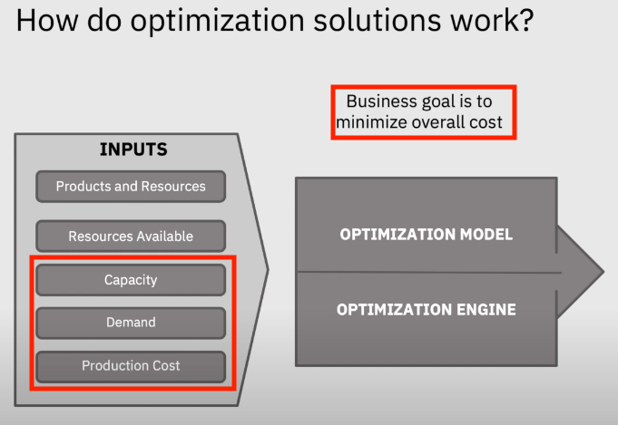

## Intro to Decision Optimization (Skip down to steps if familiar with Optimization problems)

### How should I use Decision Optimization to reach an optimal solution?

As shown below, there are 5 main steps in order to reach an optimal decision. As users of Decision Optimization, we are only concerned with step 1 and step 2. We want to formulate the business problem, as 
an optimization problem. That means we have to create data tables to represent our business problem.

### What is an Optimization Problem?

An Optimization problem is the problem of finding the best solution from all possible solutions. We 
do this by defining objectives, constraints, and decision variables. 


### What is an Optimization Model?

We have to create an optimization model in order to ensure that our CPLEX Optimization engine
knows how to solve the correct problem. Let's take a look at the optimization model in more detail.

An optimization model defined in terms of
 - an objective, decision variables, and constraints
 - a optimization engine to solve the model instance
 - data to create an instance of the model

### What is an Objective?

An objective is what we are trying to solve for. An example of this is maximizing (profit) or minimizing cost, as is the case in our example here.

### What is a Constraint?

A constraint is a condition that the problem must meet in order to reach an optimal solution. For our
example, we are limited by the capacity of our distribution plants. The capacity (or the maximum number of units that a plant can produce) is our constraint in this example.

### What is a Decision Variable?
A decision variable is a quantity that the decision-maker controls. In our case, the decision-maker is 
the CPLEX Optimization engine, and the quantity that it controls is the quantity of each product to 
be produced at a particular plant.


### Optimization Use Cases

Some of the main use cases for optimization are portfolio allocation based on risk-reward, allocation of 
human resources, and determining which plant should manufacture which product, which is the focus of this tutorial.


## Steps

1. [Create Watson Studio service](#1-Create-watson-studio-service)

2. [Create a project](#2-Create-a-project)

3. [Create a Decision Optimization experiment](#3-create-a-decision-optimization-experiment)

4. [Explore other options](#4-explore-other-options)

5. [Run the model](#5-run-the-model)

6. [Explore solution](#6-explore-solution)

7. [Create a new scenario different model same data](#7-create-a-new-scenario-different-model-same-data)

8. [Visualization within model builder](#8-visualization-within-model-builder)

9. [Generating a Python notebook from your scenario](#9-generating-a-python-notebook-from-your-scenario)

10. [Additional examples for different domains](#10-additional-examples-for-different-domains)


### 1. Create Watson Studio service

First login to your IBM Cloud account. Use the video below for directions on how to create IBM Watson Studio Service.


* After logging into IBM Cloud, click `Proceed` to show that you have read your data rights.

* Click on `IBM Cloud` in the top left corner to ensure you are on the home page.

* Within your IBM Cloud account, click on the top search bar to search for cloud services and offerings. Type in `Watson Studio` and then click on `Watson Studio` under `Catalog Results`.

* This takes you to the Watson Studio service page. There you can name the service as you wish. For example, one may name it 
`Watson-Studio-trial`. You can also choose which data center to create your instance in. The gif above shows mine as 
being created in Dallas.

* For this guide, you choose the `Lite` service, which is no-charge. This has limited compute; it is enough
to understand the main functionality of the service.

* Once you are satisfied with your service name, and location, and plan, click on create in the bottom-right corner. This creates your Watson Studio instance. 

* Go to https://cloud.ibm.com/resources and then click on your recently created `Watson Studio` service.

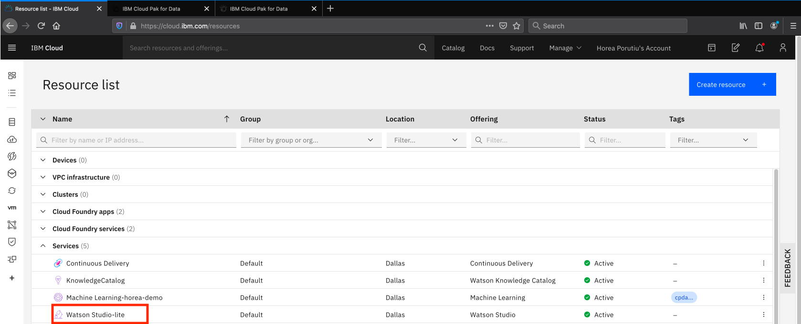

* Next, click on `Get Started`.


### 2. Create a project

Once you click on your Watson Studio serivce, you should be taken to `Cloud Pak for Data` overview page. From there, click on `Projects`.

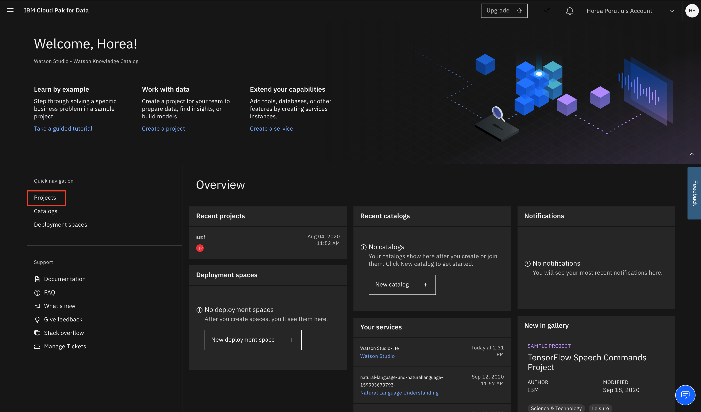

You will be taken to a page which shows your projects. Click on `New Project`.

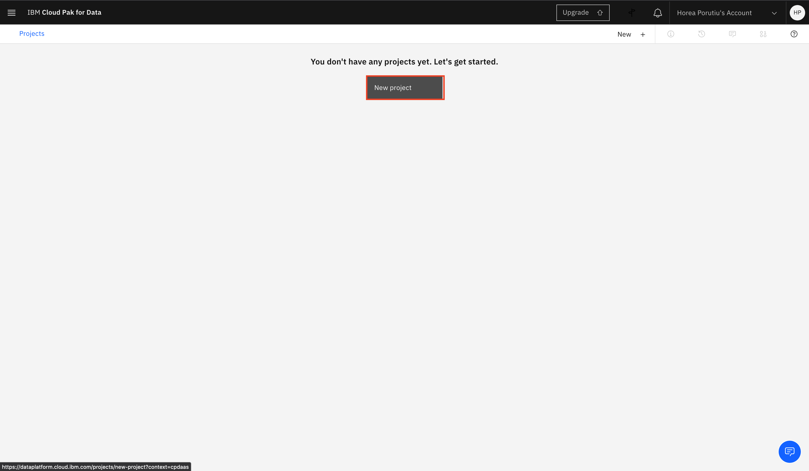

Next, you will be given the option to create a project from a file or from scratch. Click on `Create an empty project`.

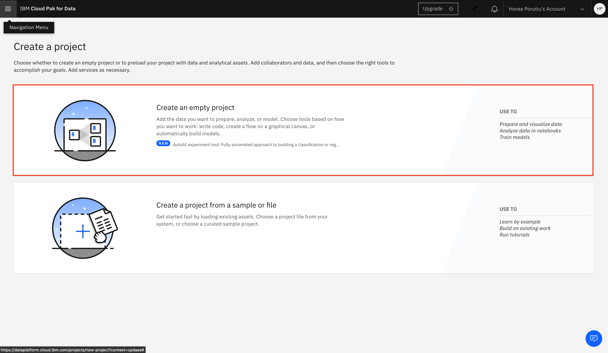

Next, you will define your project details. First we need to add a storage service. Click on `Add`.


This will take you to the create Cloud Object Storage page. Name your resource as you wish, and click `Create`.

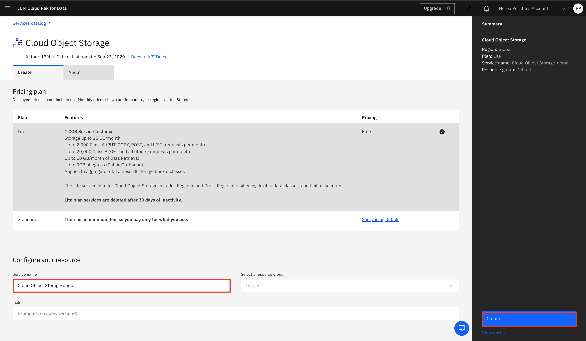

Next, once you go back to your new project, your newly created Cloud Object Storage should automatically be detected. Name 
the project as you want, and click `Create`.

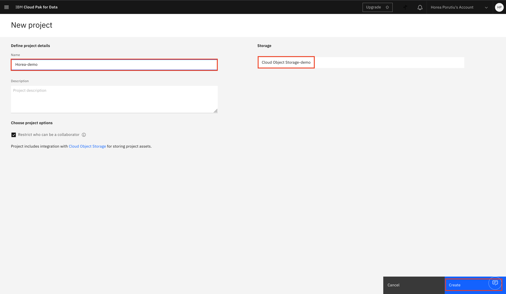

### 3. Create a Decision Optimization experiment

Next, from your newly created project, click on `Add to project`.


Select `Decision Optimization experiment`.


You will be taken to the New Decision Optimization experiment page. You'll need a Machine Learning service to work with Decision Optimization. 
Click on `Add service`.


This will take you to the `Associate service` page. Click on `New service`, unless you already have a Watson Machine Learning service.


Next, click on `Machine Learning`.

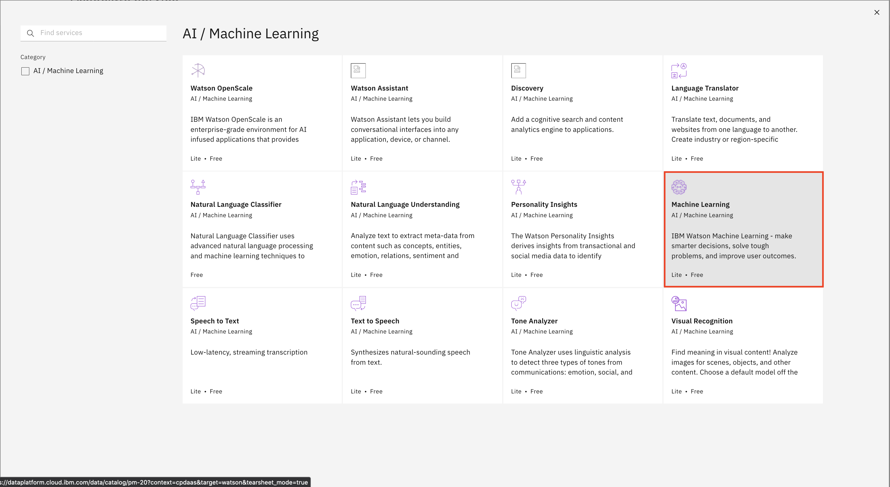

This will take you to the create Machine Learning service page. Name the service as you want, and then click `Create`.


You will be directed back to the `Associate service` page. This time, your newly created Machine Learning service should appear. Click on 
the check-mark next to it, and then on `Associate service`.

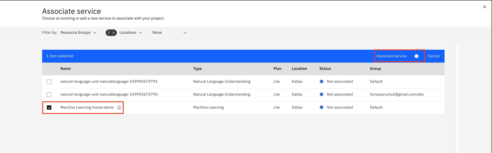

### 4. Create a Deployment space

After you associate your service, you should be taken back ot the `New Decision Optimization experiment` page. Next, we need to add a Deployment space. If you do not have one yet, click on `Create a Deployment space`.


Name the deployment space as you want, and then click `Create`.


Back on your `New Decision Optimization experiment` page, your newly created deployment space should be populated. Click `Create`.


### 5. Clone the repo

In a terminal of your choice, issue the following command to clone this repository so that you have all the data files needed for 
our experiment.

```
git clone https://github.ibm.com/Horea-Porutiu/decision-optimization-case-study.git
```

### 6. Prepare the data

Next, from the project overview page click on `Assets` from the top tab, and then go down to your newly created `Decision Optimization experiment` and click on it.

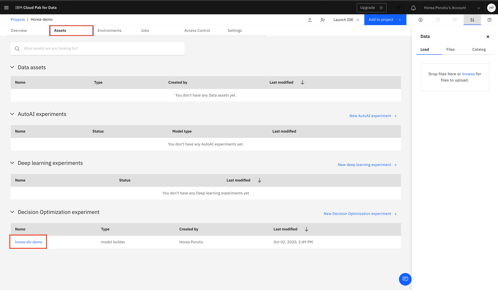

You will then be taken to the `Prepare data` page of your experiment. Click on browse in the top-right to add data.


Browse to where you cloned the repository, and go to `decision-optimization-case-study/tutorials/decision-optimization-tutorial/intro-scenario/data` and then select `plants.csv` and `customerDemand.csv` and click `Open`.


Next click on `Import`.

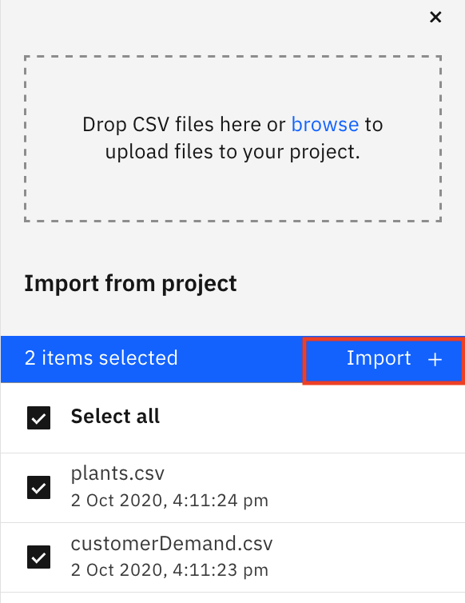

Next, from the `Prepare data` page, click on `Run model`.

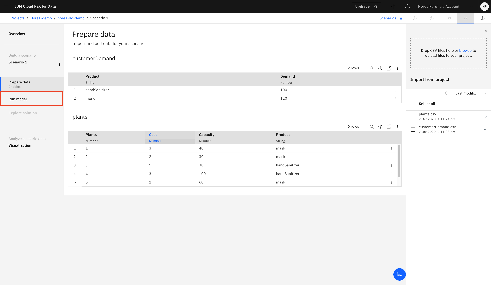
Next, click on Modeling assistant.

Next, you'll be asked to choose the domain of your problem. Choose `Selection and Allocation`.


Next, we will choose the decision variable. This is what the model will be deciding. For us, it's the optimal number of items to be produced at a certain plant.

Choose the `plants` table, and then click `continue`.
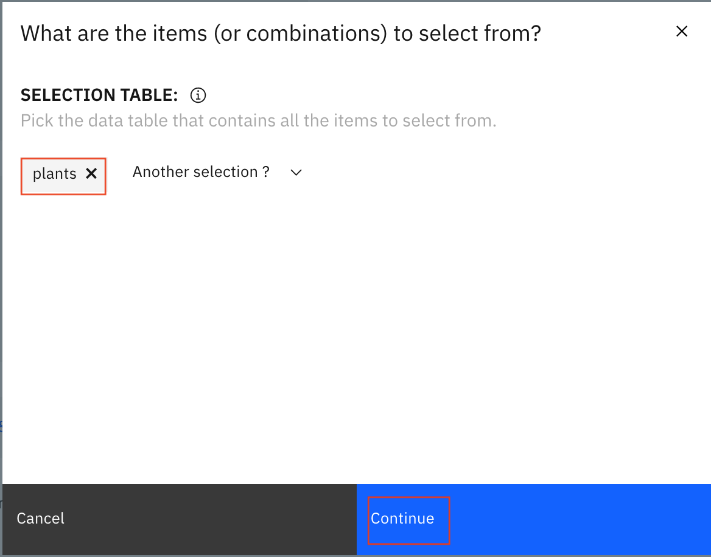
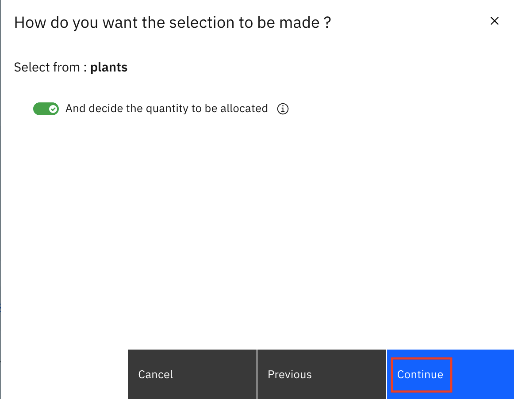


### 7. Add Objectives


### 8. Add Objectives


<!-- You will also need to download and unzip the files in [data folder](https://github.com/nmdoshi/WatsonStudio-Tutorial-COVID19-Analysis/tree/master/Tutorial3%20-%20Decision%20Optimization/data)

 We will be using decision optimization model builder for this tutorial. To learn more about model builder please click [here](https://www.ibm.com/support/producthub/icpdata/docs/content/SSQNUZ_current/do/DODS_Mdl_Assist/exhousebuildintro.html) -->
<!-- 

## Steps

0. [Create IBM Cloud services](#0-Create-watson-studio-service)

1. [Add a Decision Optimization to your Watson Studio Project](#1-Add-a-decision-optimization-to-your-watson-studio-project)

2. [Import the data required to build the model](#2-import-the-data-required-to-build-the-model)

3. [Run models and analyze results](#3-run-model-and-analyze-results)

4. [Explore other options](#4-explore-other-options)

5. [Run the model](#5-run-the-model)

6. [Explore solution](#6-explore-solution)

7. [Create a new scenario different model same data](#7-create-a-new-scenario-different-model-same-data)

8. [Visualization within model builder](#8-visualization-within-model-builder)

9. [Generating a Python notebook from your scenario](#9-generating-a-python-notebook-from-your-scenario)

10. [Additional examples for different domains](#10-additional-examples-for-different-domains)

### 0. Create IBM Cloud Services 

First login to your IBM Cloud account. Use the video below for directions on how to create IBM Watson Studio Service.


* After logging into IBM Cloud, click `Proceed` to show that you have read your data rights.

* Click on `IBM Cloud` in the top left corner to ensure you are on the home page.

* Within your IBM Cloud account, click on the top search bar to search for cloud services and offerings. Type in `Watson Studio` and then click on `Watson Studio` under `Catalog Results`.

* This takes you to the Watson Studio service page. There you can name the service as you wish. For example, one may name it 
`Watson-Studio-trial`. You can also choose which data center to create your instance in. The gif above shows mine as 
being created in Dallas.

* For this guide, you choose the `Lite` service, which is no-charge. This has limited compute; it is enough
to understand the main functionality of the service.

* Once you are satisfied with your service name, and location, and plan, click on create in the bottom-right corner. This creates your Watson Studio instance. 


* To launch your Watson Studio service, go back to the home page by clicking on `IBM Cloud` in the top-left corner. There you see your services, and under there you should see your service name. This might take a minute or two to update. 

* Once you see your service that you just created, click on your service name, and this takes you to your 
Watson Studio instance page, which says `Welcome to Watson Studio. Let's get started!`. Click on the `Get Started` button.

* This takes you to the Watson Studio tooling. There you see a heading that says `Start by creating a project` and a button that says `Create Project`. Click on `Create a Project`. Next click on `Create an Empty project`.

* On the create a new project page, name your project. You also need to associate an IBM Cloud Object store instance, so that you store the data set.

* Under `Select Storage service` click on the `Add` button. This takes you to the IBM Cloud Object Store service page. Leave the service on the `Lite` tier and then click the `Create` button at the bottom of the page. You are prompted to name the service and choose the resource group. Once you select a name, click the resource group `Confirm` button. 

* Once you've confirmed your IBM Cloud Object Store instance, you are taken back to the project page. Click on `refresh` and you should see your newly created Cloud Object Store instance under `Storage`. That's it! Now you can click `Create` at the bottom right of the page to create your first IBM Watson Studio project :) 


### 1. Add a Decision Optimization to your Watson Studio Project

* Click on your newly created project.

* Once you have created your Watson Studio Project, you see a blue `Add to Project` button on the top-right corner of your screen.


* Click the `Decision Optimization Experiment`. Select a Watson Machine Learning service from the dropdown menu.Note: If Watson Machine Learning service is not available then create a service using Lite plan


### 2. Import the data required to build the model
* Click the `Find and add data`. icon on the top right side and click on `browse`.as shown below


* Select all files and  Click `Open`. and import 5 input files required for building this model. The data can be found in [data](https://github.com/nmdoshi/WatsonStudio-Tutorial-COVID19-Analysis/tree/master/Tutorial3%20-%20Decision%20Optimization/data) folder of the github repo


    Product.csv - This file contains product information. the columns in the file as follows
    Product - name of the products
    cost - cost to procure the products
    qty_per_unit - number of product in 1 unit
    unit_of_measure - metrics
    importanceFactor - importance with respect to pandemic
    required_qty_per_person - It is amount of product needed per patient/cases

    ProductAvailability.csv - These file contains product that is available for entire state to be distributed to the counties.
    Product - name of the products
    Availability - Qty of units available for that time period

    County.csv - This file is output from SPSS model where we are forecasting the number of potential cases for next 5 days
    County - name of the County
    forecasted_cases - no of forecasted new COVID cases
    forecasted_death - no of forecasted deaths

    CountyDemand.csv - This is the data collected from various counties with respected to their requirement for various products
    County - name of the county
    product - name of the product
    demand - units of preoduct requested to be supplied

    AllocationParameters - Budget allocated for the state

* Next, import files into model builder by selecting the files. Click `Import`.


### 3. Run model and analyze results
* Click on `Run model` on model builder and you will see 3 options to build optimization model. For this example we use the modeling assistant, Click `Use Modeling Assistant`


There are different decision domains currently available in the Modeling Assistant and you can be guided to choose the right domain for your problem. Documentation on different domains can be found [here](https://www.ibm.com/support/producthub/icpdata/docs/content/SSQNUZ_current/do/DODS_Mdl_Assist/mdl_asst_domains.html)

For this problem we will be using Selection and Allocation domain. Selection problems are about choosing from a list of possibilities. You can use the Selection and Allocation domain when you have combined all the possible choices. We would like to select the products(which are resources) for this model that we can allocate to counties.

**Selection & Allocation domain**

* Click `Selection & Allocation` domain and it asks series of questions. It needs to understand which table to select the data. The first question asked is `What are the items (or combinations) to select from?` Click on `Choose a table` drop down menu and select `CountyDemand` table. The next question is around allocation. The modeling assistant needs to understand if this is just a selection problem or it is combination of selection and allocation. The question asked is `How do you want the selection to be made ?` Turn the toggle on to allocate quantities and Click `Continue`. This will now frame the modeling problem automatically. You will see a screen that shows `Select and allocate CountyDemands.` Click `Finish`


* **Define Objectives** - In this step we would like to define our Objectives.

  **Objective 1**

      The first thing we would like is to allocate as much product that we can to the counties. In the suggestion section one can freely write the objective in English as an natural language. We will type in `Maximize total CountyDemand allocations` and hit enter. This will then show the list of all possible suggestions related to the CountyDemand table. Click the `+` icon next to the suggested objective. You will see that the objective is moved to the left-hand side under Objectives

  **Objective 2**

    The second objective is to make the allocation fair with respect to demand. In the suggestion box type `Balance gap between allocation  and demand over CountyDemands` look at all the suggestions and pick the one that has the objective.

  **Remove Objective**

    On the left-hand side when we formulated the objective the modeling assistant had already assumed an objective called `Maximize the total CountyDemand selections`. We don't need that so we can click the three dots next to it and it shows the options. Click `Remove`


* **Define constraints**

  There are 3 constraints that we need to add

  **Constraint 1**  
    Since the quantities are in integers we want to make sure that the selection and allocation must be integers. To do so we will type `All CountyDemand allocations  must be integer` in suggestions section. Click the `+` icon to add to the models

  **Constraint 2**  
    Allocation of quantities need to be less the requested demand by counties. To do so we will type `For each CountyDemand , allocation  is less than or equal to  demand` in suggestions section. Click the `+` icon to add to the models

  **Constraint 3**  
    Overall budget for entire state is limited and allocation needs to be below allocated budget(in total units). To do so we will type `total CountyDemand allocations  is less than or equal to  max_budget of AllocationParameters ` in suggestions section. Click the `+` icon to add to the models


### 4. Explore other options

  **The Suggestions filter**
    You can also filter the suggestions to find objectives and constraints. Set Display by category to on (a tick is displayed on the switch) which opens a pane for you to select various categories of interest and apply filters to the list of suggestions. The filters enable you to see fewer suggestions.

  **The Settings tab**
    The Settings tab in the model view lists different scheduling and optimization parameters that can be edited. In this example the default duration unit, the optimization run time and the date/time format are shown. You can specify here a customized date/time format to suit your data.
  **The Data Schema tab**

    The Data Schema tab view lists, table by table, all information that the Modeling Assistant has imported and deduced from the input data that is necessary for the scheduling problem to be solved. This can be useful for expert users for data debugging purposes.


### 5. Run the model
You can change the solve time limit for your model in the model view in the Settings tab on the right. For this example, use the default limit. Other parameters can also be set using run configuration parameters (see [Run parameters](https://www.ibm.com/support/producthub/icpdata/docs/content/SSQNUZ_current/do/DODS_RunParameters/runparams.html#RunConfig) for more information).

Click `Run model` on the top. Combined Objective is displayed in this run status pop-up window. If you want to end this run before the optimal solution is obtained, you can quit by clicking Stop


### 6. Explore solution

* When the run is completed, you can see the results in the `Explore solution` view. You can also click LOG to inspect the solver engine log files. The first table in the Explore solution view shows the objective (or objectives if you have several) with its values and the subsequent tables provides product selection and allocation.You can also download the solution tables as csv files.


### 7. Create a new scenario different model same data

* Although you have solved the model in reality we need the units based on importance of products needed. For example ventilators and masks have a high importance and is needed first to save lives. We need to readjust the model to reflect the reality and maximize allocation based on importanceFactor

Create a new scenario in the model from scenario 1. Click the Scenario button on top of the page and scenario panel opens on the side. You will see Scenario 1 on it you will notice three dots, Click on it to see the drop down menu. Click the `Duplicate` and you will be prompted to give a name of new scenario. Type `Baseline with Importance` Click `Create`


* Click Run Model on left-hand side and it will show the modeling assistant model. In the suggestions type `Maximize total importanceFactor of product of allocation`. You will see the `Maximize total importanceFactor of product of CountyDemands over all allocations` objective in the suggestion. Click the `+` icon to add the objective to the model. You can use the slider to give this objective  more importance.


Click `Run Model` and look at the solution in `Explore Solution` on left-hand-side

Click the Scenario button on top of the page and scenario panel opens on the side. You will see Scenario 1 on it you will notice three dots, Click on it to see the drop down menu. Click the `Rename` and you will be prompted to give a name of new scenario. Type `Baseline`


### 8. Visualization within model builder

* Click `Visualization` to build a dashboard.Click pencil icon to open visualization editor. Click `Json` and delete the content.


Open the [visualization.json file](https://github.com/nmdoshi/WatsonStudio-Tutorial-COVID19-Analysis/blob/master/Tutorial3%20-%20Decision%20Optimization/data/visualization.json). Copy the contents and paste in the Json editor
You should see the following Dashboard


### 9. Generating a Python notebook from your scenario

* If you want to generate a Python notebook from your model created with the Modeling Assistant:
  * If the scenario panel is not open, click the `Scenarios` icon.
  * Click the three dots next to one of your scenarios and select `Generate` notebook.
  * Enter a name for your notebook and click Generate.
  * A Python notebook for this model is created in your Project.


### 10. Additional examples for different domains
* Download and unzip the DO-samples from the [Decision Optimization GitHub](https://github.com/IBMDecisionOptimization/DO-Samples/tree/watson_studio_cloud) on to your machine.

### Summary


Optimization-based decision applications involve embedded optimization models and algorithms as part of larger applications that may include
integration with databases and other enterprise systems. These applications can be used to perform A-B testing, where users can compare different scenarios, each involving different data.

By invoking the optimization model interactively and repeatedly, users can judge the impact of data changes, and analyze trade-offs between conflicting business goals and constraints.

This tutorial demonstrates a small example of creating a prescriptive optimization model on IBM Decision Optimization on Watson Studio(CPLEX engine). The tutorial goes over on importing the scenario into the project and running the model. The last step of the tutorial is about how to visualize and evaluate the results. -->
