# Use Decision Optimization to minimize the cost of distribution 
 This hands-on lab is created around the persona of a store manager. The manager has information about the demand, and wants to ensure that inventory is optimized by minimizing the cost of distribution. There are many distribution plants to pick from, each with their own capacity and their own cost. Our goal is to minimize the total cost, while still ensuring we meet all of the demand.

In the previous tutorial we used SPSS Modeler to build a model to predict demand. As you can see below, we will use the demand as input, 
and other information about the distribution plants such as production cost and capacity, to reach
our goal of minimizing overall cost.

## Learning Objectives

In this tutorial, you will explore the following key capabilities:
 * You will learn how to build Optimization model
 * A model builder to guide developers through the typical optimization development steps
 * Dashboards for communicating the optimization model results

## Prerequisites

Required software, access, and files
To complete this lab, you will need:
* IBM Cloud Pak for Data
* IBM Watson Machine Learning Service

## Estimated Time
After the prerequisites are met, it should take you around 35-45 minutes to complete this tutorial.

If you are familiar with optimization problems, you can skip down to step 1.


## Intro to Decision Optimization 

[Skip down to steps if familiar with Optimization problems](https://github.ibm.com/Horea-Porutiu/decision-optimization-case-study/tree/master/tutorials/decision-optimization-tutorial/intro-scenario#steps)

### How should I use Decision Optimization to reach an optimal solution?

As shown below, there are 5 main steps in order to reach an optimal decision. As users of Decision Optimization, we are only concerned with step 1 and step 2. We want to formulate the business problem, as 
an optimization problem. That means we have to create data tables to represent our business problem.

### What is an Optimization Problem?

An Optimization problem is the problem of finding the best solution from all possible solutions. We 
do this by defining objectives, constraints, and decision variables. 

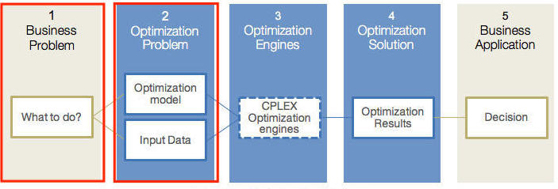

### What is an Optimization Model?

We have to create an optimization model in order to ensure that our CPLEX Optimization engine
knows how to solve the correct problem. Let's take a look at the optimization model in more detail.

An optimization model defined in terms of
 - an objective, decision variables, and constraints
 - a optimization engine to solve the model instance
 - data to create an instance of the model

### What is an Objective?

An objective is what we are trying to solve for. An example of this is maximizing (profit) or minimizing cost, as is the case in our example here.

### What is a Constraint?

A constraint is a condition that the problem must meet in order to reach an optimal solution. For our
example, we are limited by the capacity of our distribution plants. The capacity (or the maximum number of units that a plant can produce) is our constraint in this example.

### What is a Decision Variable?
A decision variable is a quantity that the decision-maker controls. In our case, the decision-maker is 
the CPLEX Optimization engine, and the quantity that it controls is the quantity of each product to 
be produced at a particular plant.


### Optimization Use Cases

Some of the main use cases for optimization are portfolio allocation based on risk-reward, allocation of 
human resources, and determining which plant should manufacture which product, which is the focus of this tutorial.

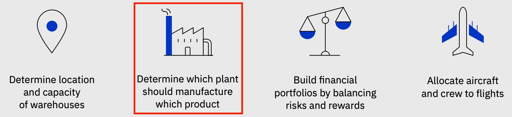

## Steps

1. [Create Watson Studio service](#1-Create-watson-studio-service)

2. [Create a project](#2-Create-a-project)

3. [Create a Decision Optimization experiment](#3-create-a-decision-optimization-experiment)

4. [Explore other options](#4-explore-other-options)

5. [Run the model](#5-run-the-model)

6. [Explore solution](#6-explore-solution)

7. [Create a new scenario different model same data](#7-create-a-new-scenario-different-model-same-data)

8. [Visualization within model builder](#8-visualization-within-model-builder)

9. [Generating a Python notebook from your scenario](#9-generating-a-python-notebook-from-your-scenario)

10. [Additional examples for different domains](#10-additional-examples-for-different-domains)


### 1. Create Watson Studio service

First login to your IBM Cloud account. Use the video below for directions on how to create IBM Watson Studio Service.


* After logging into IBM Cloud, click `Proceed` to show that you have read your data rights.

* Click on `IBM Cloud` in the top left corner to ensure you are on the home page.

* Within your IBM Cloud account, click on the top search bar to search for cloud services and offerings. Type in `Watson Studio` and then click on `Watson Studio` under `Catalog Results`.

* This takes you to the Watson Studio service page. There you can name the service as you wish. For example, one may name it 
`Watson-Studio-trial`. You can also choose which data center to create your instance in. The gif above shows mine as 
being created in Dallas.

* For this guide, you choose the `Lite` service, which is no-charge. This has limited compute; it is enough
to understand the main functionality of the service.

* Once you are satisfied with your service name, and location, and plan, click on create in the bottom-right corner. This creates your Watson Studio instance. 

* Go to https://cloud.ibm.com/resources and then click on your recently created `Watson Studio` service.


* Next, click on `Get Started`.

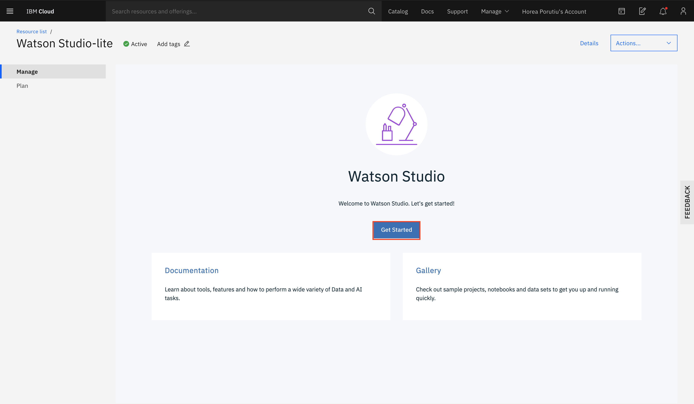

### 2. Create a project

Once you click on your Watson Studio serivce, you should be taken to `Cloud Pak for Data` overview page. From there, click on `Projects`.


You will be taken to a page which shows your projects. Click on `New Project`.


Next, you will be given the option to create a project from a file or from scratch. Click on `Create an empty project`.


Next, you will define your project details. First we need to add a storage service. Click on `Add`.

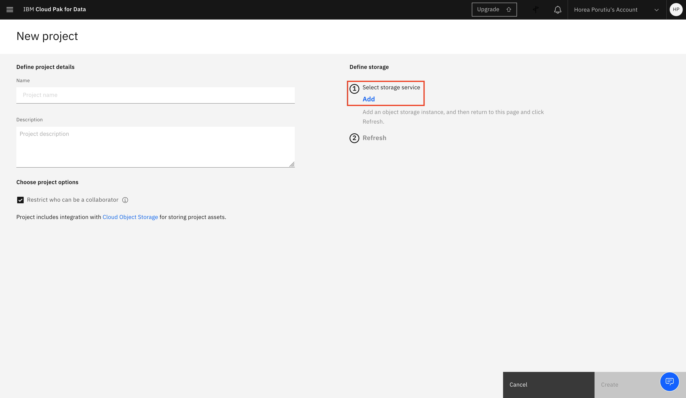

This will take you to the create Cloud Object Storage page. Name your resource as you wish, and click `Create`.


Next, once you go back to your new project, your newly created Cloud Object Storage should automatically be detected. Name 
the project as you want, and click `Create`.


### 3. Create a Decision Optimization experiment

Next, from your newly created project, click on `Add to project`.

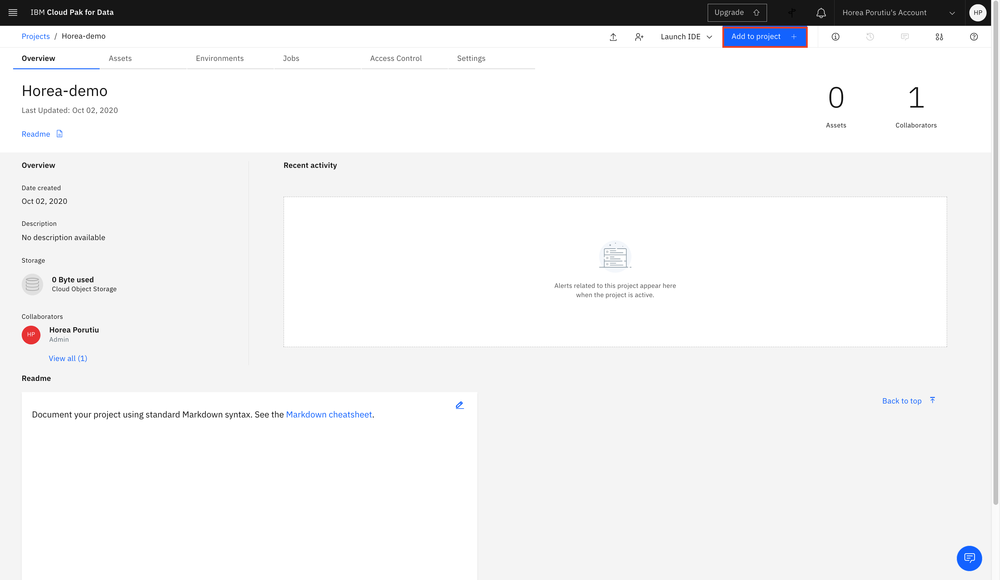

Select `Decision Optimization experiment`.

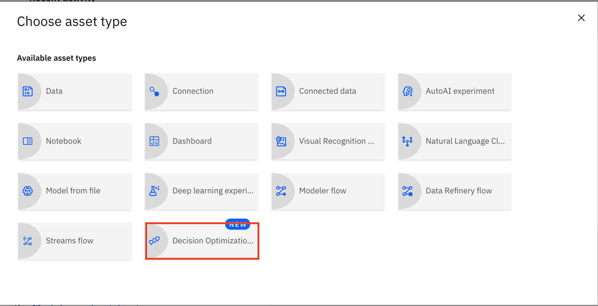

You will be taken to the New Decision Optimization experiment page. You'll need a Machine Learning service to work with Decision Optimization. 
Click on `Add service`.

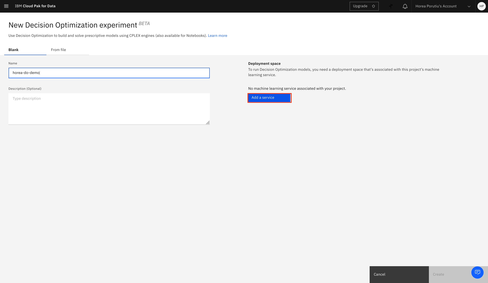

This will take you to the `Associate service` page. Click on `New service`, unless you already have a Watson Machine Learning service.

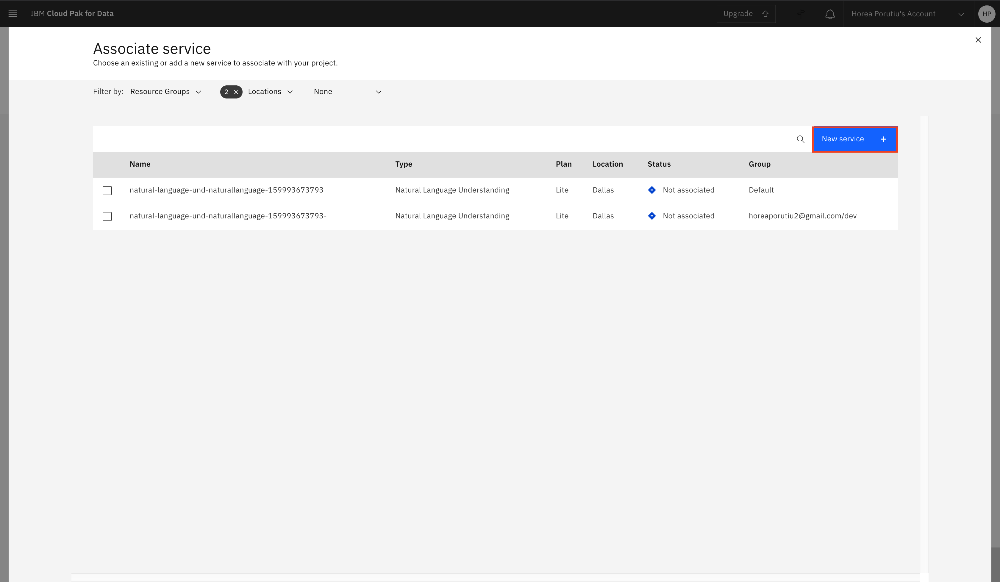

Next, click on `Machine Learning`.


This will take you to the create Machine Learning service page. Name the service as you want, and then click `Create`.

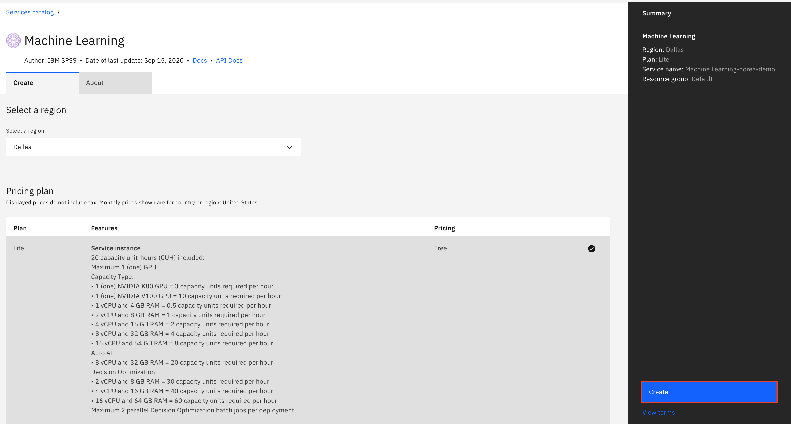

You will be directed back to the `Associate service` page. This time, your newly created Machine Learning service should appear. Click on 
the check-mark next to it, and then on `Associate service`.


### 4. Create a Deployment space

After you associate your service, you should be taken back ot the `New Decision Optimization experiment` page. Next, we need to add a Deployment space. If you do not have one yet, click on `Create a Deployment space`.


Name the deployment space as you want, and then click `Create`.

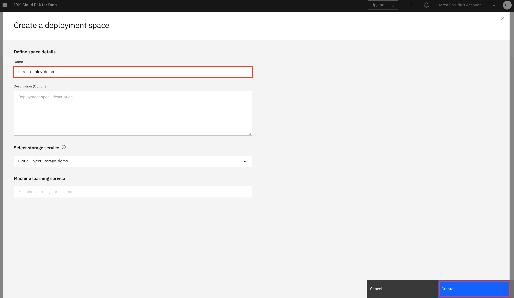

Back on your `New Decision Optimization experiment` page, your newly created deployment space should be populated. Click `Create`.


### 5. Clone the repo

In a terminal of your choice, issue the following command to clone this repository so that you have all the data files needed for 
our experiment.

```
git clone https://github.ibm.com/Horea-Porutiu/decision-optimization-case-study.git
```

### 6. Prepare the data

Next, from the project overview page click on `Assets` from the top tab, and then go down to your newly created `Decision Optimization experiment` and click on it.


You will then be taken to the `Prepare data` page of your experiment. Click on browse in the top-right to add data.

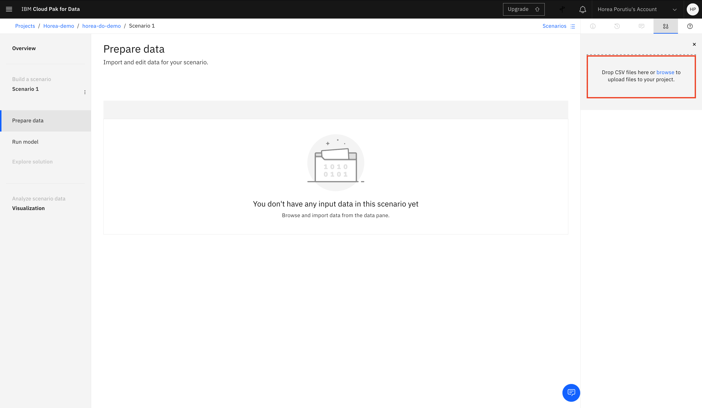

Browse to where you cloned the repository, and go to `decision-optimization-case-study/tutorials/decision-optimization-tutorial/intro-scenario/data` and then select `plants.csv` and `customerDemand.csv` and click `Open`.

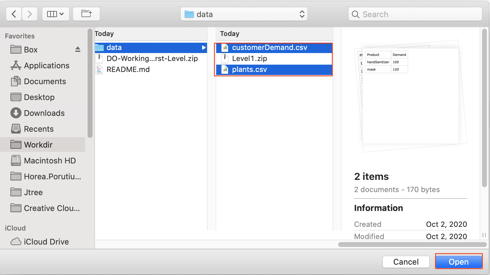

Next click on `Import`.


### 7. Prepare the Model

Next, from the `Prepare data` page, click on `Run model`.


Next, click on Modeling assistant.
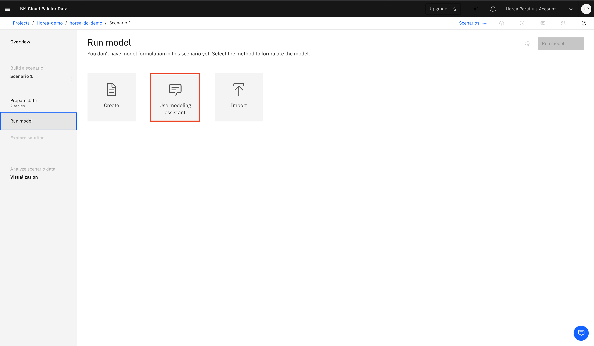
Next, you'll be asked to choose the domain of your problem. Choose `Selection and Allocation`.

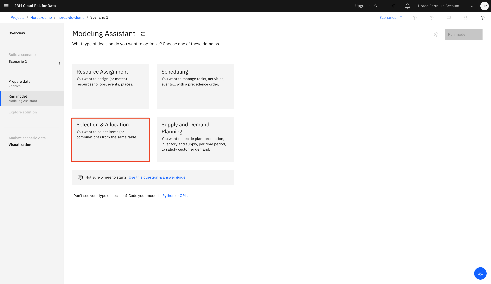

Next, we will choose the decision variable. This is what the model will be deciding. For us, it's the optimal number of items to be produced at a certain plant.

Choose the `plants` table, and then click `continue`.


### 8. Add Objectives

* Now the first thing we must do after we have prepared our problem statement is to add our objectives.

* First, delete the default objective.

* Next, type in `maximize total plants allocations` into the `Suggestions` box. Click on the plus sign to add it to our model.

* Next, type in `minimize total cost of plants over all allocations` into the `Suggestions`. Add this to our model. 


### 9. Add Constraints

* The default constraint for our problem is to `Synchronize seleciton with plants allocations`. Expand this statement to 
define the max and min values. 

* Ensure that the max allocation of plants is defined by `Capacity`.

* Next, the min assignment of plants is `0`.

* Next, move the slider next to `Maximize total plants allocations` to 10, in order to prioritize this objective.

* Next, type in `All plants allocations must be integer` into the `Suggestions`. Add this to our model. 


### 10. Explore Solution
Next, make sure the objectives and constrains are the same as the screenshot below, and then click on `Run model` from the
top-right.


* Let's examine our data. Our primary goal with our optimization is to meet demand since we prioritized that objective by moving the slider to 10.
* We know that demand is 100 for hand sanitizer and 120 for masks.
* We also know there are two plants that have high cost (3). We want to limit allocating masks and hand sanitizer 
from those plants as much as possible.

* Let's examine the solution. Click on the button next to the magnifying glass to open the table in a full screen.

* We can now examine the solution. We see that from the plant that produces mask with the highest cost of 3, we have allocated 0. We also see that from the plant that produces hand sanitizer with the highest cost of 3, we allocated only 70 units, which is below capacity of the plant. All other plants allocated all of capacity, other than plant 2 which allocated 15 units to masks, since we already produced enough for demand.


### 11. Conclusion
<b>Congatulations!</b> You've just finished running your first decision optimization experiment. You know understand 
how to setup a decision optimization problem, import data, set objectives and contraints, and then run the model. 

In the next part of the tutorial, we will look at a more complex problem with more data tables and more constraints. 

We will also show how to deploy the model to Watson Machine Learning and interact with the model using a web-app.