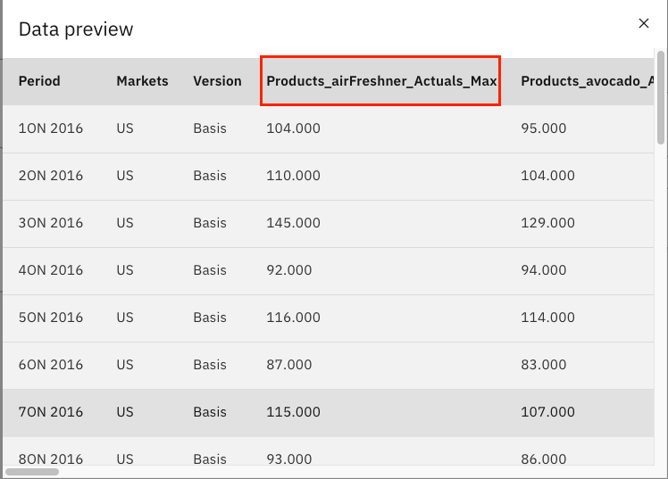

# Predict future product demand using SPSS Modeler

As mentioned in our previous article, our goal is to build an intelligent inventory and distribution strategy using AI. In this part of the 
solution, we will work on predicting future demand of our products to help us determine our optimal inventory level using SPSS Modeler for Watson Studio on IBM Cloud. SPSS Modeler is a data mining and analytics software
that is used to build predictive models. Using SPSS Modeler for Watson Studio
enables data scientists and data analysts to work in a collaborative, cloud-based environment and quickly share their models and results with
their stakeholders. 

## Learning objectives
After completing this tutorial, the user will learn: 
* How to upload data to IBM Watson Studio
* How to create an SPSS Modeler flow
* How to use the SPSS tool to profile and analyze data
* How to modify, filter, and prepare data for AI Model creation
* How to train a machine learning model with SPSS and evaluate the results


## Prerequisites
This tutorial assumes you have an IBM Cloud account. Go to the link below to sign up for a no-charge trial account - no credit card required.
  - [IBM Cloud account](https://tinyurl.com/y4mzxow5)

## Estimated Time
Completing this tutorial should take about 30 minutes.

## Steps

1. [Create Watson Studio service on IBM Cloud](#1-Create-a-Watson-Studio-service-on-IBM-Cloud)
2. [Create a project in Watson Studio and upload the data](#2-create-a-project-in-Watson-Studio-and-upload-the-data)
3. [Add a Modeler Flow to your Watson Studio Project](#3-Add-a-modeler-flow-to-your-watson-studio-project)
4. [Import the data](#4-import-the-data)
5. [Explore the data](#5-explore-the-data)
6. [Data preparation](#6-data-exploration)
7. [Train the ML model](#7-Train-the-ML-model)
8. [Evaluate the results ](#8-Evaluate-the-results)

### 1. Create Watson Studio service on IBM Cloud

The first step in this tutorial is to set up your IBM Cloud [Watson Studio service](https://cloud.ibm.com/catalog/services/watson-studio). See the video below to help you create your free
IBM Watson Studio service.

* After logging into IBM Cloud, click `Proceed` to show that you have read your data rights.

* Click on `IBM Cloud` in the top left corner to ensure you are on the home page.

* Within your IBM Cloud account, click on the top search bar to search for cloud services and offerings. Type in `Watson Studio` and then click on `Watson Studio` under `Catalog Results`.

* This takes you to the Watson Studio service page. There you can name the service as you wish. For example, one may name it 
`Watson-Studio-trial`. You can also choose which data center to create your instance in. The gif above shows mine as 
being created in Dallas.

* For this guide, you choose the `Lite` service, which is no-charge. This has limited compute; it is enough
to understand the main functionality of the service.

* Once you are satisfied with your service name, and location, and plan, click on create in the bottom-right corner. This creates your Watson Studio instance. 


### 2. Create a project in Watson Studio and upload the data

* To launch your Watson Studio service, go back to the home page by clicking on `IBM Cloud` in the top-left corner. There you see your services, and under there you should see your service name. This might take a minute or two to update. 

* Once you see your service that you just created, click on your service name, and this takes you to your 
Watson Studio instance page, which says `Welcome to Watson Studio. Let's get started!`. Click on the `Get Started` button.

* This takes you to the Watson Studio tooling. There you see a heading that says `Start by creating a project` and a button that says `Create Project`. Click on `Create a Project`. Next click on `Create an Empty project`.

* On the create a new project page, name your project. One may name the project - `insurance-demo`. You also need to associate an IBM Cloud Object store instance, so that you store the data set.

* Under `Select Storage service` click on the `Add` button. This takes you to the IBM Cloud Object Store service page. Leave the service on the `Lite` tier and then click the `Create` button at the bottom of the page. You are prompted to name the service and choose the resource group. Once you select a name, click the resource group `Confirm` button. 

* Once you've confirmed your IBM Cloud Object Store instance, you are taken back to the project page. Click on `refresh` and you should see your newly created Cloud Object Store instance under `Storage`. That's it! Now you can click `Create` at the bottom right of the page to create your first IBM Watson Studio project :) 


* Once you have created your Watson Studio Project, you see a blue `Add to Project` button on the top-right corner of your screen. 


* Select `Data`.

* On the right-hand side bar, click on `browse` and then go to where you cloned the repository, and select `TM1 Import.csv`.


* Once the upload has finished, you should see `Upload Successful` as shown below. 


### 3. Add a Modeler Flow to your Watson Studio Project

* Click on your newly created project.

* Once you have created your Watson Studio Project, you see a blue `Add to Project` button on the top-right corner of your screen. 


* Click on `Add to Project` and then select `Modeler Flow`. 


* Next, select `From File` and `browse` to where you cloned this repository. If you haven't done so, run the following command to clone the repo: 

```
git clone https://github.com/IBM/optimize-procurement-and-inventory-with-ai/
```

 Select the `Demand Forecast.str` file. Next, click `Create`.


### 4. Import the data

Next, you should see your flow, as shown below.


On the leftmost side of the flow, under Data Import, hover over the `TM1 Import` node.
You should see a three-dot icon show up. Click it. 


Next, click on `Open`.


This will open up the right-hand side panel with the TM1 Import node details. Click on
`Change data asset`.


Next, from the left hand side click on `Data assets` and then click `TM1 Import.csv`. Next, click `OK`.


Next, click `Save` on the right-hand side panel.


Once the flow is updated, you will be ready to explore the data.

### 5. Explore the data

Before we do any analysis and predictions on the data, it's 
a good idea to explore your data set. 

* From the `Data Import` section, hover over the green node that
says "6 Fields" and 
click on the three-dot symbol to the right of the node. Next,
click on `Run`.


* Once the node runs, click on 
the Clock icon. Next, under the `Outputs` section
should be a section which says `Data Audit of [6 Fields]`. Double-click on that section.


* Here you you can get a visual representation of your data set, 
and see some sample graphs of your columns. You can see some 
statistical measures such as max, mean, standard deviation and 
how many fields are valid. You can see that the max for our Actuals
field (which is the demand for our product) is 331, but the mean 
is much lower, at 44. Lastly, you can see how many valid records there are for each column. 


* Once you are done exploring the data set, you can return back to the flow
by clicking on the flow name in the top-left breadcrumb.

### 6. Data preparation
Next, we will focus on the data prep nodes. These are the nodes
which will modify our data set to predict just the values we want. A great way to understand what each node is 
doing is to `Preview` the node.

* To preview a node, such as the `TM1 Import` node, hover over the node, and click on the three-dot symbol.


* Next, click on `Preview`.


* This is a quick and easy way to see what the data looks like at the current node in the flow. Below is what you should see 
once you've previewed the node.


* Hover over the `Date` node, click on the `Three-dot` symbol, 
and then on `Preview`.

* Once you preview the node, you should see that the Date node adds another column to the data set, called 
`Date` and derives that value from the `Period` column. 


* The `Filter` node, which comes right after the `Date` node, takes out the `Statistical Base Forecast column`, and leaves the other columns as is.

* Next, the `Select` node is very important. It's going to take a subset of the data, and it will use an expression to do so. You can 
see in the expression, we have only taken the `US` markets, and the `Date` when it is before Jan 2019. This will enable use to make more 
specific predictions, only for the `US` market, since that is where our retail store manager that we want to focus on is located. If you 
preview this node, you will see that the `Markets` column does not feature any value other than `US`.


* The last of the data prep nodes is the `Type` node. This enables us to make specific operations on the fields within our data set. In 
this node, we split the `Products` column into individual values, so that we can later predict demand 
for each of our products within that column.


* Next, the restructure node creates new columns for the dataset. It takes the values from the 
`Products` column, and adds the `Actual` demand value for that product, in a separate column, so that
demand for a specific product is easily distinguishable.

* Hover over the `Restructure` node, click on the `Three-dot` symbol, and then `Preview` to see the
new columns that are added to our data set.


* Also, feel free to `Open` the node as well, which will show you how we generated multiple fields
from merging the `Products` and `Actuals` columns.


* Hover over the `Aggregate` and then click `Open`. 
There, you will see that we are taking the largest
value from the fields such as `Products_mask_Actuals` that we created above. This is because we want  and ensure we have enough in inventory to 
satisfy the maximum demand.


* Similarly, hover over the `Aggregate` node, click on the `Three-dot` symbol, and then `Preview` to see the
new columns with the `_Max` suffix added to them.



* Hover over the `Type` and then click `Open`. 
There, you will see we've designated the new
fields that we created in the previous steps 
as the target variables, since we want to predict 
the max demand for each of the products within 
the `Products` column, within the `US` market.


### 7. Train the ML model

* Hover over the `29 fields` golden nugget and then click `Run`. 
This will run the time-forecasting model with the data we have 
prepared in the previous steps.


* Once the model 
has finished running, you will see the Outputs tab has been
updated.


### 8. Evaluate the results 

* Double-click on `Analysis of [29 fields]` in the Outputs tab.
Here you can see an assessment of the mean error, maximum error
and other values which compare the `$TS-Products_Actuals_Max` i.e. the maximum demand forecasted by the model for a particular product, versus `Products_Actuals_Max` which is the max which has 
been recorded for the training period i.e. 2016-2018.


* Double-click on `Analysis of [10 fields]` in the Outputs tab.
Here you will see a visual representation of a few of the 
interesting products which have shown to have spiked in demand
over the past three months of training data. In October, 
November, and December of 2018, these five particular products,
masks, hand sanitizer, and spray cleaner have all spiked in 
demand, much higher than previously recorded, such that the 
forecasted values for 2019, the year we are predicting, are all
much higher due to these three months of training data. We can see this by the slope of the line increasing drastically in the 
`$TS-Products_Actuals_Max` charts vs. the `Products_Actuals_Max`
charts.


### Summary 

This tutorial demonstrates a small example of creating a predictive machine learning model on IBM SPSS Modeler on Watson Studio and IBM SPSS Modeler software. The tutorial goes over on importing the data into the project and the modeler flow, and preparing the data for modeling. The tutorial then goes over the running a time series algorithm for the data and training a prediction model. The last step of the tutorial is about how to visualize and evaluate the results of the trained model.
