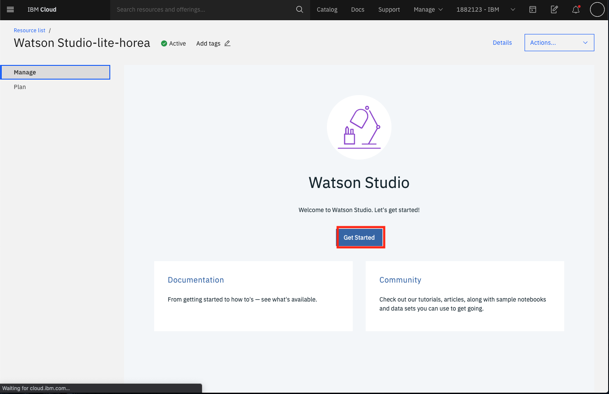

## Use SPSS Modeler to predict demand for retail

As mentioned in our previous article, our goal is to build an intelligent inventory and distribution strategy using AI. In this part of the 
solution, we will work on predicting future demand of our products to help us determine our optimal inventory level. Currently, our 
procurement manager has asked the development team to create a model to optimize inventory and minimize total landed cost. The first 
part of this solution is to quickly create a model using SPSS Modeler, something that Michelle, our data analyst is very familiar with.
First, let's take a look at the data set we are using to predict demand.

## Prerequisites

This tutorial assumes you have an IBM Cloud account. Go to the link below to sign up for a no-charge trial account - no credit card required.
  - [IBM Cloud account](https://tinyurl.com/y4mzxow5)

### Create a modeler flow within Watson Studio on IBM Cloud to view the data
The first step in this tutorial is to set up your IBM Cloud [Watson Studio service](https://cloud.ibm.com/catalog/services/watson-studio). See the video below to help you create your free
IBM Watson Studio service.

Next, once your service has been created, go to your resource list from `https://cloud.ibm.com/resources` and then click on `Services`. There you should
see your newly created Watson Studio service. Click on it. Then click on `Get Started` as shown below.

