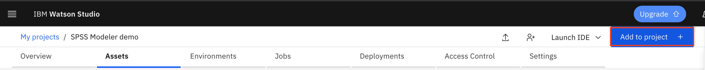
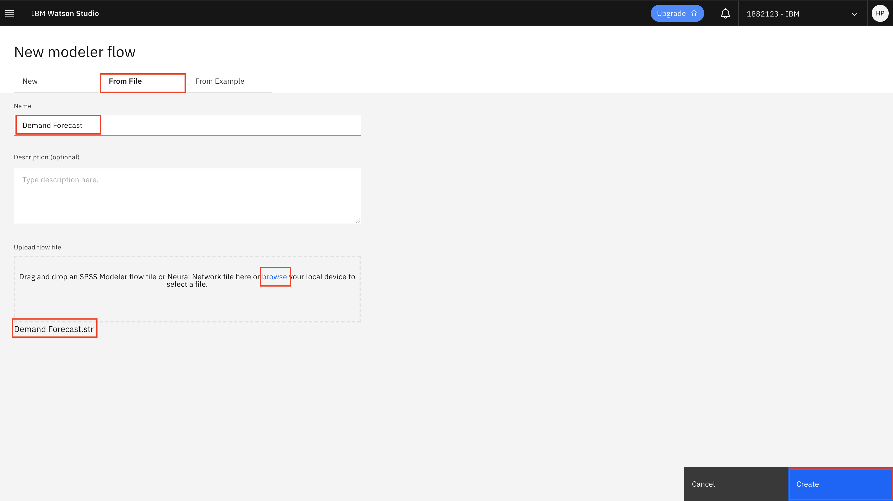
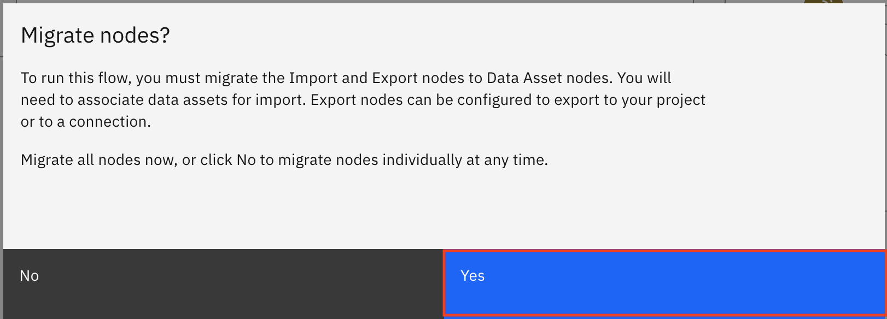
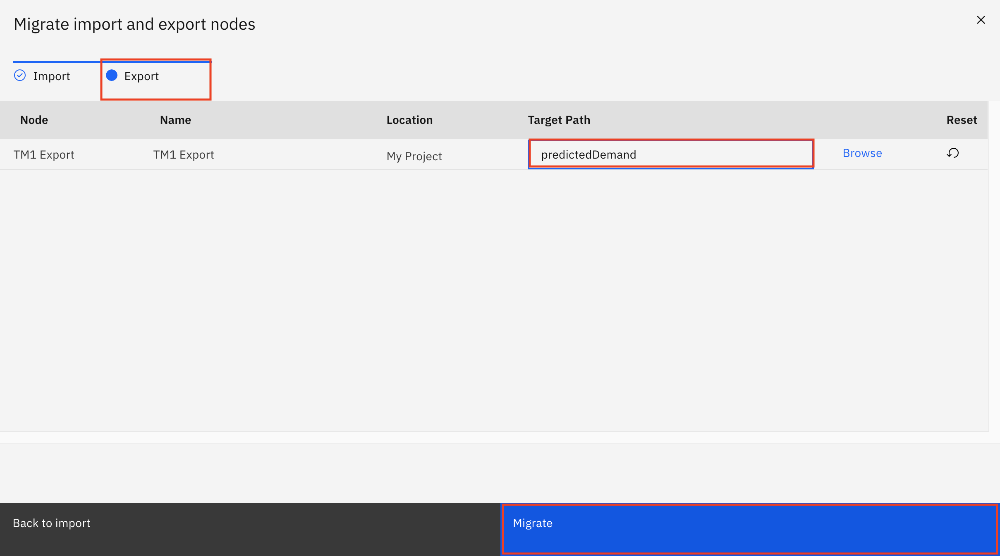

## Use SPSS Modeler to predict demand for retail

As mentioned in our previous article, our goal is to build an intelligent inventory and distribution strategy using AI. In this part of the 
solution, we will work on predicting future demand of our products to help us determine our optimal inventory level. Currently, our 
procurement manager has asked the development team to create a model to optimize inventory and minimize total landed cost. The first 
part of this solution is to quickly create a model using SPSS Modeler, something that Michelle, our data analyst is very familiar with. As a 
data analyst, the first step we want to take is to explore the data. Let's quickly setup our IBM Cloud envioronment so that we can view and build a 
model with the data.

## Prerequisites

This tutorial assumes you have an IBM Cloud account. Go to the link below to sign up for a no-charge trial account - no credit card required.
  - [IBM Cloud account](https://tinyurl.com/y4mzxow5)

### Create a modeler flow within Watson Studio on IBM Cloud to view the data
The first step in this tutorial is to set up your IBM Cloud [Watson Studio service](https://cloud.ibm.com/catalog/services/watson-studio). See the video below to help you create your free
IBM Watson Studio service.

* After logging into IBM Cloud, click `Proceed` to show that you have read your data rights.

* Click on `IBM Cloud` in the top left corner to ensure you are on the home page.

* Within your IBM Cloud account, click on the top search bar to search for cloud services and offerings. Type in `Watson Studio` and then click on `Watson Studio` under `Catalog Results`.

* This takes you to the Watson Studio service page. There you can name the service as you wish. For example, one may name it 
`Watson-Studio-trial`. You can also choose which data center to create your instance in. The gif above shows mine as 
being created in Dallas.

* For this guide, you choose the `Lite` service, which is no-charge. This has limited compute; it is enough
to understand the main functionality of the service.

* Once you are satisfied with your service name, and location, and plan, click on create in the bottom-right corner. This creates your Watson Studio instance. 

* To launch your Watson Studio service, go back to the home page by clicking on `IBM Cloud` in the top-left corner. There you see your services, and under there you should see your service name. This might take a minute or two to update. 

* Once you see your service that you just created, click on your service name, and this takes you to your 
Watson Studio instance page, which says `Welcome to Watson Studio. Let's get started!`. Click on the `Get Started` button.

* This takes you to the Watson Studio tooling. There you see a heading that says `Start by creating a project` and a button that says `Create Project`. Click on `Create a Project`. Next click on `Create an Empty project`.

* On the create a new project page, name your project. One may name the project - `insurance-demo`. You also need to associate an IBM Cloud Object store instance, so that you store the data set.

* Under `Select Storage service` click on the `Add` button. This takes you to the IBM Cloud Object Store service page. Leave the service on the `Lite` tier and then click the `Create` button at the bottom of the page. You are prompted to name the service and choose the resource group. Once you select a name, click the resource group `Confirm` button. 

* Once you've confirmed your IBM Cloud Object Store instance, you are taken back to the project page. Click on `refresh` and you should see your newly created Cloud Object Store instance under `Storage`. That's it! Now you can click `Create` at the bottom right of the page to create your first IBM Watson Studio project :) 

* Click on your newly created project.

* Once you have created your Watson Studio Project, you see a blue `Add to Project` button on the top-right corner of your screen. 

* Click on `Add to Project` and then select `Modeler Flow`. 

* Next, select `From File` and `browse` to where you cloned this repository. Select the `Demand Forecast.str` file. Next, click `Create`.

* SPSS Modeler will then ask you to migrate nodes. Click on `Yes`.

* For the import node, click on `Data Assets` and then choose the `TM1 Import.csv` file, which contains our demand data for our retail products. Next, click `OK`.

* For the export node, click on `Target Path` and then choose type out `predictedDemand`. This will be the file name that is created when our model outputs the
predicted demand. This file will be saved to our current project in Watson Studio. Click `Migrate`.

