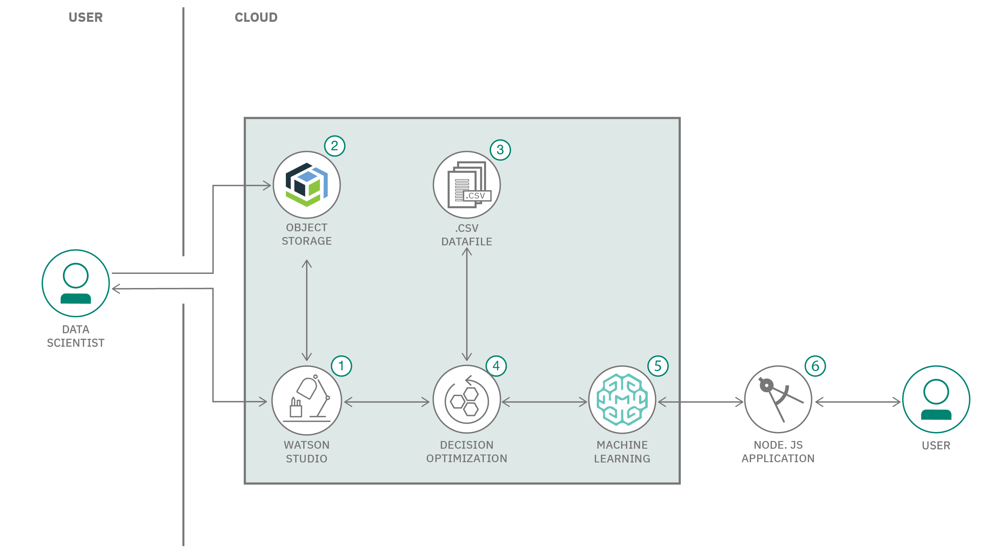

# Create a web application to optimize your supply chain inventory

In this code pattern, learn how to create a web-based application to optimize inventory. This code pattern is part of the [Develop an intelligent inventory and procurement strategy using AI](https://developer.ibm.com/articles/develop-an-intelligent-inventory-and-distribution-strategy-using-ai/) series, which provides an overview of an inventory and procurement strategy, and explains how a development team can use machine learning tools and techniques to predict demand and control costs.


Using historical demand data to train a machine learning model, you can predict demand for certain items more accurately in the future, and ensure that your customers are able to purchase what they want. Using this predicted demand as input, along with manufacturing plant data such as cost and capacity, this application enables a store manager to quickly choose the best manufacturing plants to optimize inventory and minimize cost.

When you have completed this code pattern, you understand how to:

* Deploy a Node.js-based web application
* Send and receive messages from a deployed IBM Watson® Machine Learning model using REST APIs

## Flow



1. The user creates an IBM Watson Studio Service on IBM Cloud.
2. The user creates an IBM Cloud Object Storage Service and adds that to Watson Studio.
3. The user uploads the demand and plant data files into Watson Studio.
4. The user creates an Decision Optimization experiment and sets objectives to minimize cost via the modeling assistant.
5. The user saves the Decision Optimization as a model, and deploys it using Watson Machine Learning.
6. The user uses the Node.js application to connect to the deployed model via API and finds the optimal plant selection based on cost and capacity.

## Prerequisites

1. Use the [Optimize plant selection based on cost and capacity with Decision Optimization](https://developer.ibm.com/tutorials/optimize-inventory-based-on-demand-with-decision-optimization/) tutorial and follow the step-by-step approach of building and deploying a decision optimization model using a UI-based modeling assistant. In that tutorial's [Deploy the model](https://developer.ibm.com/tutorials/optimize-inventory-based-on-demand-with-decision-optimization/#deploy-model) step, you deploy the model used by this code pattern and save the deployment ID and space GUID necessary to configure this application.

1. This code pattern assumes you have an **IBM Cloud** account. Go to the link below to sign up for a no-charge trial account - no credit card required.

   * [IBM Cloud account](https://tinyurl.com/y4mzxow5)

1. This code pattern uses Node.js.

   * [Node.js](https://nodejs.org/en/download/)

## Steps

1. [Clone the repo](#step-1-clone-the-repo)
2. [Set the Model Deployment ID](#step-2-set-the-model-deployment-id)
3. [Set the Space GUID](#step-3-set-the-space-guid)
4. [Create an IBM Cloud API key](#step-4-create-an-ibm-cloud-api-key)
5. [Generate the access token](#step-5-generate-the-access-token)
6. [Run the application](#step-6-run-the-app)

## Step 1. Clone the repo

If you haven't already cloned the repo (used in the tutorials), run the following command to clone the repo in the location of your choice.

```bash
git clone https://github.com/IBM/optimize-procurement-and-inventory-with-ai.git
```

Next, prepare to configure your application by changing to the `web-app` directory of your clone and copying the `env.sample` to a hidden file named `.env`.  This `.env` file is used to provide the environment variables for your configuration in the next steps.

```bash
cd optimize-procurement-and-inventory-with-ai/web-app
cp env.sample .env
```

## Step 2. Set the Model Deployment ID

In order for our web-app to communicate with our deployed Watson Machine Learning model, we must set a few environmental variables that our app depends on. The variables are the following:

* Deployment ID
* Space GUID
* Authorization Token or `TOKEN`

If you haven't followed the steps in the previous tutorial to deploy your Decision Optimization model, you can find the steps [here](https://developer.ibm.com/tutorials/optimize-inventory-based-on-demand-with-decision-optimization/#deploy-model).

Once you have copied your Deployment ID, go ahead and edit the `.env` file and fill in the `DEPLOYMENT_ID` line. It should look like the following when it is done:

```bash
DEPLOYMENT_ID='2cbb1ae1-aeb5-zzzzz-b540-76b18de12ca1'
```

## Step 3. Set the Space GUID

Follow the step **Save your Space GUID** in the previous tutorial [here](https://developer.ibm.com/tutorials/optimize-inventory-based-on-demand-with-decision-optimization/#save-your-space-guid-needed-for-api-access-) to find your Space GUID where your model is deployed.

Edit the `.env` file and fill in the `SPACE_ID` line. It should look like the following when it is done:

```bash
SPACE_ID='6b00e95c-e9c2-zzzz-a01e-01dee680ef87'
```

## Step 4. Create an IBM Cloud API key

Before we can create our authorization token, we need an IBM Cloud API key.

* Go to `cloud.ibm.com` and then from the top-right part of the screen click on `Manage`-> `IAM`.


* Next, click on `API keys` from the left side-bar. Next click on `Create an IBM Cloud API key`.


* Name the key as you wish, and then click `Create`.


* Once the key is created, click on the `Download` button.


## Step 5. Generate the access token

* From the command line, type `curl -V` to verify if cURL is installed in your system. If cURL is not installed, refer to [this](https://develop.zendesk.com/hc/en-us/articles/360001068567-Installing-and-using-cURL#install) instructions to get it installed.

* Execute the following cURL command to generate your access token, but replace the apikey with the apikey you got from step 4 above.

```bash
curl -X POST 'https://iam.cloud.ibm.com/oidc/token' -H 'Content-Type: application/x-www-form-urlencoded' -d 'grant_type=urn:ibm:params:oauth:grant-type:apikey&apikey=<api-key-goes-here>'
```

As shown in the image below, the apikey can be copy and pasted from the downloaded file from the end of step 4. The curl request would look something like this after the apikey is pasted in:


```bash
curl -X POST 'https://iam.cloud.ibm.com/oidc/token' -H 'Content-Type: application/x-www-form-urlencoded' -d 'grant_type=urn:ibm:params:oauth:grant-type:apikey&apikey=aSULp7nFTJl-jGx*******aQXfA6dxMlpuQ9QsOW'
```

Once you run that command, you should see something like the following:

```json
{"access_token":"eyJraWQiOiIyMDIwMTAyMjE4MzMiLCJhbGciOiJSUzI1NiJ9.eyJpYW1faWQiOiJJQk1pZC01MEFWSzExMDVEIiwiaWQiOiJJQk1pZC01MEFWSzExMDA","refresh_token":"OKCYCb-IdO4HCPUwtJBhtDOhBBz8xvarvbdaWB6n9W2G9IqeOOuMRS7Gs-SP46VGa0LmVVvRwldJiiiBEfVLqYTY5dBZ9MTOf51S5AfC51FbHmHWJuFVTo6","ims_user_id":7560901,"token_type":"Bearer","expires_in":3600,"expiration":1604608674,"refresh_token_expiration":1607197074,"scope":"ibm openid"}%     
```

Copy and paste only the `access_token` part into the `.env` file. Once you've done this, it should look
something like below: (Note that I cut part of the token above, so normally it's much longer)

```bash
TOKEN='Bearer eyJraWQiOiIyMDIwMTAyMjE4MzMiLCJhbGciOiJSUzI1NiJ9.eyJpYW1faWQiOiJJQk1pZC01MEFWSzExMDVEIiwiaWQiOiJJQk1pZC01MEFWSzExMDA'
```

Save the file. Make sure the file is named `.env`. Once you are all done updating the TOKEN, SPACE_ID, and DEPLOYMENT_ID, your file should look something like this, except your token will likely be much longer:

```bash
PORT=8080

HOST='0.0.0.0'

TOKEN='Bearer eyJraWQiOiIyMDIwMTAyMjE4MzMiLCJhbGciOiJSUzI1NiJ9.eyJpYW1faWQiOiJJQk1pZC01MEFWSzExMDVEIiwiaWQiOiJJQk1pZC01MEFWSzExMDA'

SPACE_ID='5fd82822-f9ca-4ce8-b653-f48ac3da3161'

DEPLOYMENT_ID='a8134b87-8c81-4888-8159-33bd80192e4d'
```

 **Congratulations!** You're now ready to run the app!

## Step 6. Run the app

From the `web-app` directory, run `npm install`. Once your dependencies are done installing, run `npm start` to start the application.

Next, go to http://0.0.0.0:8080 in the browser of your choice.

You should see something like this:


### Step 6.1 Default Scenario

First, go ahead and try the default scenario. Click on the `Run Scenario` button.

In a few seconds you should see that a job has been created.

Wait a few seconds, and then click on the `See Solution` button. This is the same scenario we worked with in the previous tutorial. To view the input data that is passed into our Decision Optimization model, go to the `data.js` file in the `web-app` directory.

**Note:** After you click on `See Solution` the app may take up to 20 seconds to get the results back from the model. Be patient!


### Step 6.2 Input your own data

Since our model has been trained on receiving product demand, plant cost, and plant capacity, we need to make sure our own data fits these parameters. You can start with the CSV files in the `web-app/data` directory.

Click on `Upload Data` and then select the two files you want to input. Make sure they are named `customerDemand.csv` and `plants.csv`, otherwise you will get an error.

Click on `Optimize`. Wait a few seconds and then click on `See Solution`.


## Conclusion

**Congratulations!** You've now learned how to deploy a Decision Optimization model, connect to it via the API, and use a web-app to interact with your deployed Watson Machine Learning model. For more examples around Decision Optimization, see the [Decision Optimization Samples Github page](https://github.com/IBMDecisionOptimization/DO-Samples/tree/watson_studio_cloud).

## License

This code pattern is licensed under the Apache License, Version 2. Separate third-party code objects invoked within this code pattern are licensed by their respective providers pursuant to their own separate licenses. Contributions are subject to the [Developer Certificate of Origin, Version 1.1](https://developercertificate.org/) and the [Apache License, Version 2](https://www.apache.org/licenses/LICENSE-2.0.txt).

[Apache License FAQ](https://www.apache.org/foundation/license-faq.html#WhatDoesItMEAN)
